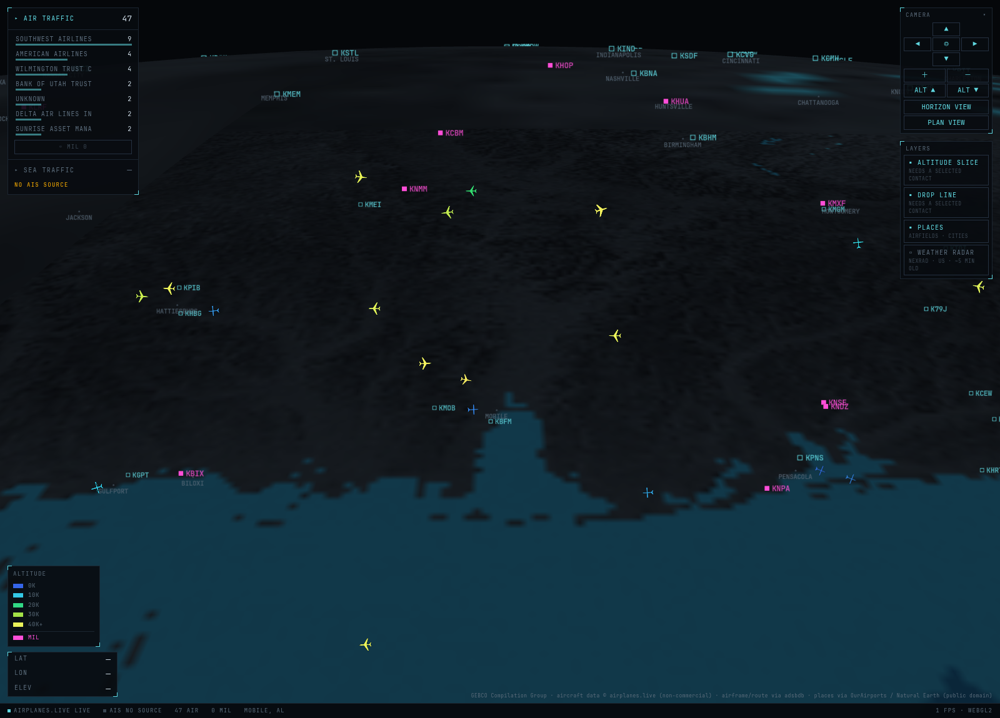
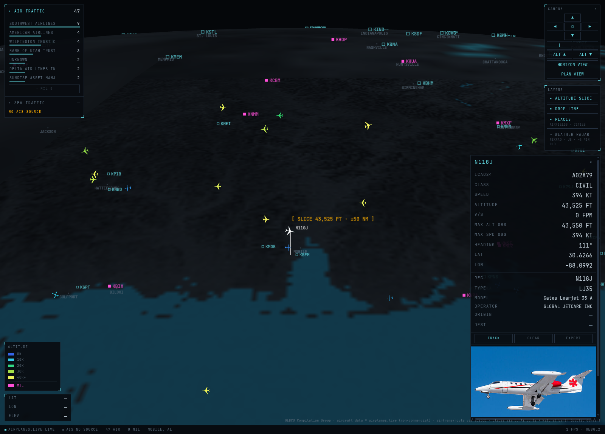
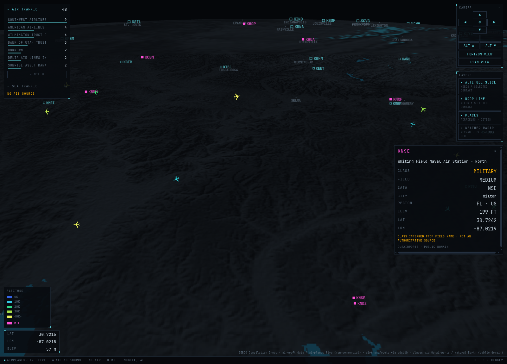

# LORAN

A self-hosted 3D globe console for live air traffic, built to be read like an instrument rather
than browsed like a website. Aircraft sit at their **true altitude above the ellipsoid** over a
dark bathymetric basemap, and everything on screen is either measured or explicitly marked
unknown.

Named for [LORAN](https://en.wikipedia.org/wiki/LORAN), the long-range navigation system used by
both ships and aircraft — because vessels are on the roadmap.

Design intent: **mission-control terminal, not consumer flight tracker.**



---

## What it looks like

Selecting a contact opens a dossier and pins an **altitude slice** at that aircraft's flight
level, with a drop line to the surface. Registration, type, model, operator and route come from
adsbdb; the photo comes from planespotters with mandatory credit. Anything nobody knows renders
as an em-dash, never as a guess.



Airfields are clickable, and the panel states the limits of what it knows — military
classification is a heuristic on the field's *name*, so it says so rather than implying an
authority it does not have.



NEXRAD weather radar is available as an optional translucent layer, **off by default** because
its green→yellow→red ramp competes with the altitude colour ramp.


All four are unretouched captures of live data, taken by `scripts/shoot_readme.py`.

---

## Ground rules

These are the rules the code is actually written to, and they are the reason to prefer this over
something prettier:

1. **Never mock, sample or synthesise data to make a screen look finished.** If a feed is down,
   rate-limited or empty, the UI says so. An honest blank panel beats a plausible fake one.
2. **Unknown values render as an em-dash (—)**, never as invented data.
3. **Stale is shown as stale.** Dead reckoning between polls is capped, and a contact that can no
   longer be honestly placed is dimmed rather than smoothed over.
4. **Claims name their own limits.** Observed peaks are labelled `MAX ALT OBS`, not "service
   ceiling". The track buffer reports the window it *actually* holds. A withheld photo is
   distinguishable from a nonexistent one.
5. **Every non-obvious decision is written down** in [`docs/decisions.md`](docs/decisions.md)
   (D-001 … D-043), including the ones that turned out to be wrong.

## Single-user and unauthenticated by design

This is a homelab console for one person. That is not laziness — it is what keeps the project
inside the non-commercial terms of the volunteer ADS-B feeds and planespotters' API terms. There
are no accounts, no roles, no multi-tenancy, and no per-user data.

There is one narrow exception: an optional **shared-secret door** (`LORAN_ACCESS_TOKENS`) so the
owner can share a link with one trusted person. It is off unless you configure tokens. See
[`docs/remote-access.md`](docs/remote-access.md).

---

## Stack

| Layer | Choice |
|---|---|
| Globe | **CesiumJS**, fully keyless — no ion token, `EllipsoidTerrainProvider` |
| UI | React 18 + TypeScript, Vite |
| State | Zustand |
| Styling | Tailwind for layout only; visual identity lives in a hand-written CSS token file |
| Backend | Python 3.12 + FastAPI + httpx |
| Storage | SQLite (WAL) — schema must port to Postgres/TimescaleDB without a rewrite |

Cesium specifically, and not globe.gl or deck.gl: true altitude-above-ellipsoid positioning,
bathymetric terrain, and translucent volumes at real altitudes.

## Quick start

Requires Node 22+, Python 3.12+.

```
cp .env.example .env
```

Set `LORAN_USER_AGENT` to something containing a **real** contact address. planespotters returns
HTTP 403 without one, and the ADS-B feeds are volunteer-funded and deserve to know who is
calling. Set `LORAN_HOME_LAT` / `LORAN_HOME_LON` to where you actually are — nothing is
hardcoded to one location.

Development, with hot reload:

```
bash scripts/dev.sh
```

That starts the API on `:8010` and Vite on `:5173`; open http://localhost:5173. Use
`bash scripts/dev.sh status` / `stop` to inspect or stop it. It resolves paths relative to
itself, so it works from any checkout or git worktree.

Production — one process serving both the built app and the API on one origin:

```
bash scripts/serve.sh
```

By hand, if you prefer:

```
cd backend && python3 -m venv .venv && .venv/bin/pip install -r requirements.txt
cd frontend && npm install && npm run build
```

`npm run dev` and `npm run build` both run `npm run cesium:assets` first, which copies Cesium's
`Workers/Assets/Widgets/ThirdParty` out of `node_modules`. Those are build artefacts, not in git,
and a fresh clone regenerates them.

Optional, regenerates the vendored airfield and city markers from upstream:

```
python3 scripts/build_places.py --refresh
```

## Data sources

Full terms review, raw response shapes and verdicts: [`docs/data-sources.md`](docs/data-sources.md).

| Feed | Role | Auth | Terms |
|---|---|---|---|
| airplanes.live | ADS-B primary | none | **non-commercial**, 1 req/sec |
| adsb.lol | ADS-B fallback | none | ODbL 1.0 (share-alike) |
| adsb.fi | ADS-B reserve | none | non-commercial |
| adsbdb | registration / type / operator / route | none | open |
| planespotters | dossier photo | none, **UA must carry a contact** | attribution mandatory; API must not be re-exposed |
| GEBCO WMS | bathymetry + depth readout | none | attribution required |
| OurAirports | airfield markers (build time) | none | public domain |
| Natural Earth | city labels (build time) | none | public domain |
| NEXRAD via Iowa State Mesonet | weather radar, off by default | none | US public domain, credit IEM |

The backend proxies and normalises feeds, enforces rate limits and caches — so the browser is not
hitting six APIs, and one upstream call serves every open tab.

**Photos are the one deliberate exception.** planespotters' terms forbid downloading, storing or
re-hosting image binaries, so the backend caches only their JSON and the browser loads images
straight from their CDN. Photographer credit is always displayed.

## Status

Works today:

- Keyless Cesium globe, tilted 3D perspective, dark GEBCO bathymetry remapped per-pixel in-browser
- Live aircraft at true altitude as type-mapped planform silhouettes, heading rotated in
  **screen space** so a tilted camera does not make level flight look like a climb
- Altitude encoded as an icon hue ramp with a legend generated from the same function the icons
  use, so the key cannot drift from the display. Military contacts in magenta
- Selection dossier: adsbdb enrichment, planespotters photo, observed peaks, track path, GeoJSON
  export that carries its own real coverage
- **ALTITUDE SLICE** pinned to the selected contact's flight level, suppressed automatically when
  the camera angle cannot convey it, plus co-altitude highlighting and a drop line
- 10,802 vendored place markers (large/medium airfields, military fields in magenta, cities),
  thinned by zoom, clickable
- Optional NEXRAD radar, self-refreshing while visible so a stale frame is never left on screen
- Optional token access for remote viewing, with preferences persisted per browser
- Measured **22–27 FPS** at 77–89 contacts on the developer's hardware (WebGL2)

Not built yet:

- **Phase 4, vessels (AIS)** — blocked on hardware, not code. aisstream.io measured *zero*
  coverage at Mobile; the plan is a self-hosted RTL-SDR AIS receiver, which needs a marine-VHF
  antenna
- **Phase 5, the recording archive** — SQLite recorder, retention, scrubber
- **Phase 6** — compass, FPS readout, status-bar polish
- Docker Compose; viewport-scoped fetch; **unit tests** (currently zero — verification is
  end-to-end against live traffic, which is honest but fragile)

## Verify it

```
python3 scripts/verify_phase1.py
```

Drives a real browser via CDP and checks nine things end to end against **live** traffic —
including that clicking a contact puts the altitude slice at exactly its altitude. Needs Chrome
on `--remote-debugging-port=9333` and the app running.

## Non-goals

No mobile layout. No satellites. No AI summarisation. No alerting engine. No accounts beyond the
single shared-secret door described above. Weather is limited to the one radar layer.

## Licence

[MIT](LICENSE) for the software. The licence grants no rights to the *data* the software fetches
— each provider's terms govern that, and several are non-commercial. Read the notes in `LICENSE`
and `docs/data-sources.md` before deploying this anywhere public.
